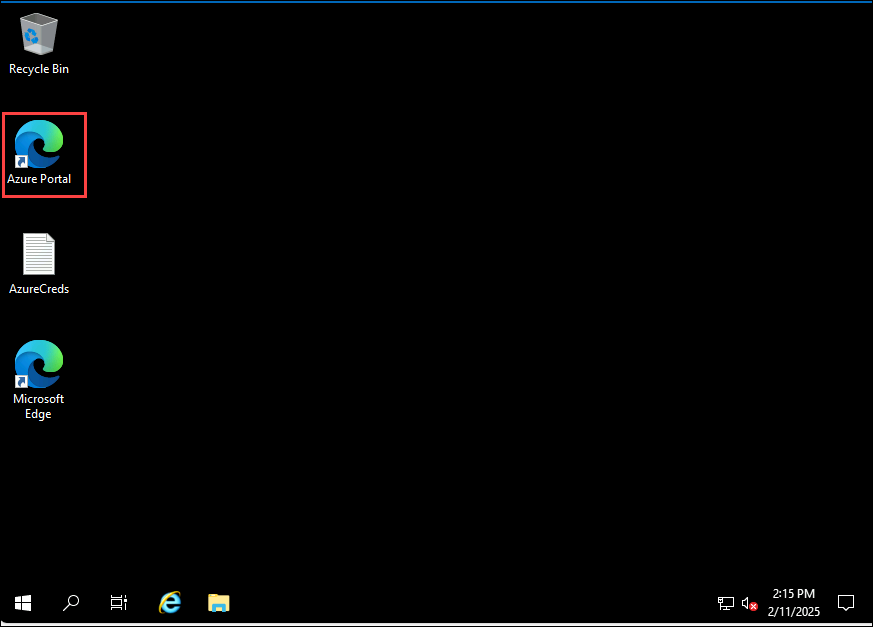
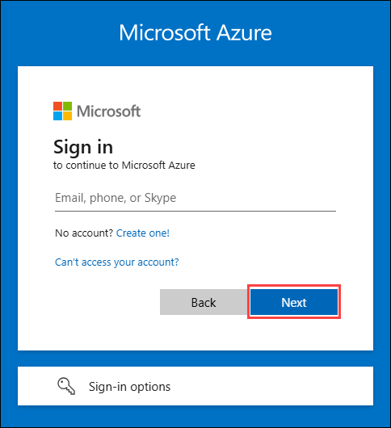
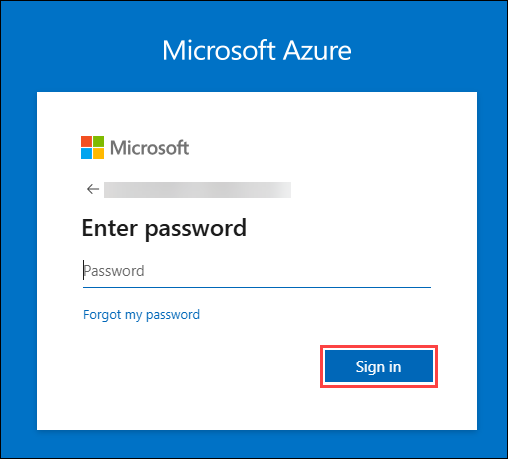
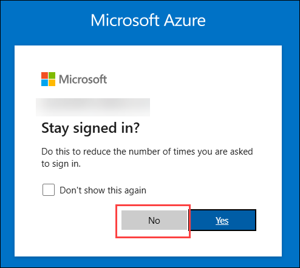
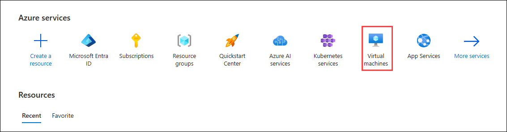

# Task 1: Create a Virtual Machine

1. On the virtual machine's desktop, click on Azure Portal icon to log in to Azure.
   
   

1. Log in to the **Azure Portal** using the credentials provided:

   - **Email:** **<inject key="AzureAdUserEmail"></inject>**
   - **Password:** **<inject key="AzureAdUserPassword"></inject>**

     

     

1. If you are prompted with **Stay signed in?** pop up then click on **No**.

   

4. In the Azure Portal, select **Virtual Machines** under **Azure Services**.

   
   
6. Click **Create** and select **Azure Virtual Machine**.

7. In the **Basics** tab, provide the following details:

   - **Subscription**: Choose **Default**.  
   - **Resource group**: Select the resource group named **ODL-Demo-<inject key="Deployment Id" enableCopy="false">-02**.  
   - **Virtual machine name**: Enter **labvm**.  
   - **Region**: Choose **west us 2**.  
   - **Availability options**: Select **No infrastructure redundancy required**.  
   - **Security type**: Select **Standard**.  
   - **Image**: Choose **Windows Server 2022 Datacenter** from the dropdown.  
   - **Size**: Select **Standard D2s_V3**.  
   - **Username**: Enter **labuser**.  
   - **Password**: Enter **Password.1!!**.  

8. Leave all other fields as **Default** and click **Review + create**.

9. Once the validation passes, click on **Create**.

10. Once the virtual machine is created click on submit button for below validation to verify that you have successfully completed the task.

# Validation 1: Create the virtual machine

<validation step="ee2358a7-d01c-4324-935d-c23346546adb" />
